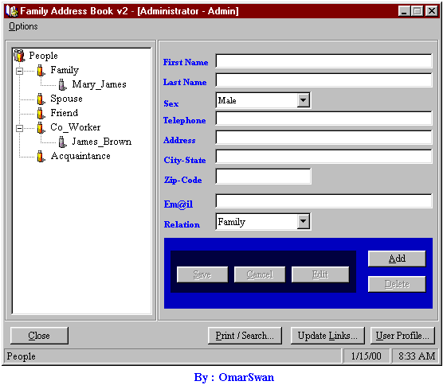



## Family Address Book v2\.0

### Description

This is a family address book program created using VB6. Its

main purpose is to store personal address book information for

each member of a family. THIS IS AN UPDATED VERSION OF THE ONES THAT I CREATED SOME TIME AGO. THIS VERSION HAS ALOT MORE FEATURES SUCH AS PRINTINING / SEARCHING, Personal Internet Links ETC. IT ALSO USES THE LISTVIEW AND TRE VIEW CONTROL TO GIVE IT A

BETTER INTERFACE.

REQUIREMENTS

Microsoft Windows Common Control 5.0(SP2) - COMCTL32.OCX

Microsoft DAO 3.51 Object Library.

Please write any question comment or suggestion. Tell me if you find any bugs.

Note : Read the file readme.txt before you begin using it. If you are running the program for the first time you have to allow the program to Create the Database file. Filesize : 296KB. CHECK IT OUT!!!. Author : OmarSwan.
 
### More Info
 

             |
---                |---
**Submitted On**   |2000-01-15 13:16:32
**By**             |[Omar Dixon \(OmarSwan\)](https://github.com/Planet-Source-Code/PSCIndex/blob/master/ByAuthor/omar-dixon-omarswan.md)
**Level**          |Intermediate
**User Rating**    |4.8 (29 globes from 6 users)
**Compatibility**  |VB 5\.0, VB 6\.0
**Category**       |[Databases/ Data Access/ DAO/ ADO](https://github.com/Planet-Source-Code/PSCIndex/blob/master/ByCategory/databases-data-access-dao-ado__1-6.md)
**World**          |[Visual Basic](https://github.com/Planet-Source-Code/PSCIndex/blob/master/ByWorld/visual-basic.md)
**Archive File**   |[CODE\_UPLOAD28801152000\.zip](https://github.com/Planet-Source-Code/omar-dixon-omarswan-family-address-book-v2-0__1-5495/archive/master.zip)

